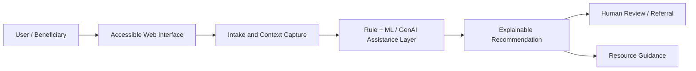

# AshaAid

### Human-centered AI support concept for accessible assistance, triage, and social-impact workflows

---

## Overview

**AshaAid** is positioned as a human-centered AI project for designing assistance-oriented workflows that can support people, institutions, or community-facing services through structured guidance, triage, information organization, and decision-support interfaces.

The repository is intended to evolve into a practical, socially relevant AI system that demonstrates how applied machine learning, generative AI, and analytics can be used responsibly for public-good or healthcare-adjacent use cases.

---

## Why This Project Matters

Many AI prototypes focus on technical novelty but miss the real human workflow. AshaAid is framed around a different question:

> How can AI make help more accessible, structured, explainable, and action-oriented without replacing human judgement?

Potential use cases may include:

- guided assistance and information routing
- healthcare or social-service support workflows
- resource recommendation interfaces
- structured intake and triage forms
- explainable decision-support dashboards
- multilingual or low-friction user guidance

---

## Intended Capabilities

| Layer | Intended Direction |
|---|---|
| User Interface | Simple, accessible, mobile-friendly interface |
| AI Assistance | Structured guidance rather than uncontrolled chatbot output |
| Data Handling | Safe intake forms, anonymized records, transparent data use |
| Decision Support | Explainable recommendations and next-step suggestions |
| Human Oversight | Designed to support, not replace, human experts |
| Deployment | Lightweight, free/open-source deployment options |

---

## Suggested Architecture

---

## Possible Technology Stack

- **Frontend:** HTML/CSS/JavaScript, Streamlit, or React
- **Backend:** Flask or FastAPI
- **AI / ML:** scikit-learn, PyTorch, TensorFlow, HuggingFace models
- **Data Layer:** CSV/SQLite/PostgreSQL depending on scale
- **Visualization:** Plotly, Power BI, or lightweight dashboard cards
- **Deployment:** GitHub Pages for static prototype; Streamlit Community Cloud or Render for app deployment

---

## Responsible AI Considerations

This repository should follow a safety-first approach:

- No medical diagnosis without qualified human review
- Clear disclaimers for advisory outputs
- Data minimization and privacy protection
- Explainable outputs wherever possible
- Bias and fairness review before real deployment
- Human-in-the-loop design for sensitive recommendations

---

## Roadmap

- [ ] Define the exact target user group and use case
- [ ] Add problem statement and user personas
- [ ] Add wireframes or screenshots
- [ ] Add working MVP interface
- [ ] Add sample data schema
- [ ] Add evaluation criteria
- [ ] Add responsible AI and privacy statement
- [ ] Add deployment guide
- [ ] Add license and citation metadata

---

## Repository Status

This project is currently a **concept / early prototype repository**. The README has been structured to make the project easier to understand, extend, and present as part of a broader applied AI portfolio.

---

## Author

**Dr. Alok Tiwari**  
Assistant Professor, Big Data Analytics  
Goa Institute of Management, Goa  

- Portfolio: [dr-alok-tiwari.github.io](https://dr-alok-tiwari.github.io/)
- GitHub: [@dr-alok-tiwari](https://github.com/dr-alok-tiwari)
- LinkedIn: [dr-alok-tiwari](https://www.linkedin.com/in/dr-alok-tiwari/)

---

**AI for social good · Human-centered assistance · Responsible decision support**

